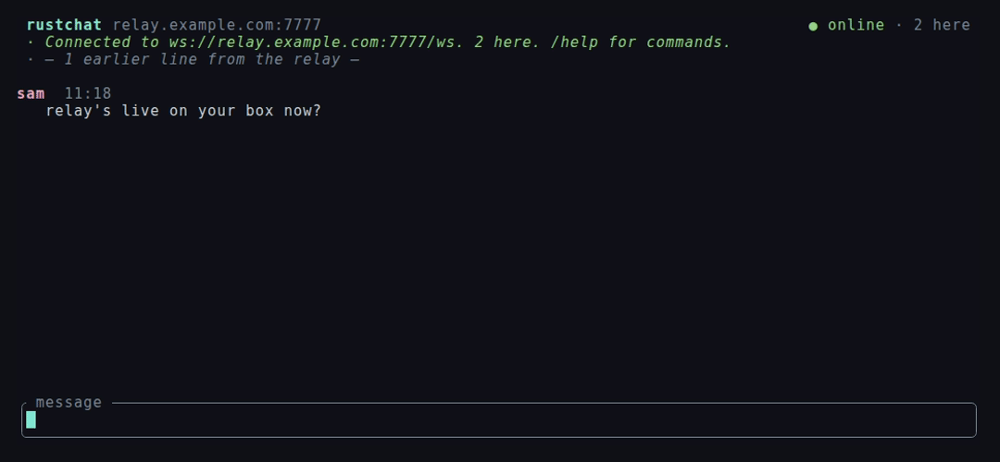

# rustchat

An end-to-end encrypted chatroom in your terminal.

One shared key per room is the whole access model: anyone holding it can join,
pick a name, and talk. Messages are sealed on your machine and opened on
everyone else's, so the relay carrying them only ever handles ciphertext — it
cannot read the rooms it serves, and is configured with no room keys at all.



## Install

```sh
curl -fsSL https://raw.githubusercontent.com/B33BMO/rustchat/main/install.sh | sh
```

That fetches a prebuilt binary, checks it against the release's `SHA256SUMS`,
and drops it on your `PATH`. If there's no prebuilt binary for your platform it
builds from source instead, provided you have Rust.

Then just:

```sh
rustchat
```

The first run walks you through creating or joining a room, and seals what it
needs into an encrypted vault. After that it only asks for your passphrase.

<details>
<summary>Other ways to install</summary>

```sh
# With the relay, for hosting your own room
curl -fsSL .../install.sh | sh -s -- --relay

# A specific version, or a specific directory
curl -fsSL .../install.sh | sh -s -- --version v0.2.0 --dir ~/bin

# From source
cargo install --git https://github.com/B33BMO/rustchat rustchat

# Remove it again
curl -fsSL .../install.sh | sh -s -- --uninstall
```
</details>

## The three secrets

Keeping these straight is most of understanding rustchat.

| | Relay access key | Room key | Your passphrase |
|---|---|---|---|
| Scope | one per relay | one per room | one per machine |
| Who has it | everyone using that relay | everyone in that room | only you |
| What it does | lets you connect at all | encrypts and decrypts messages | unlocks your local vault |
| Looks like | `rca1-…` | `rc1-…` | whatever you chose |
| The relay holds | a one-way hash of it | nothing | nothing |
| If it leaks | strangers can use your relay | that room is readable | your local vault is readable |

The **room key** is the only thing protecting what people say. There are no
accounts and no server-side identity; usernames are picked client-side and
nobody verifies them, so two people can both be `sam`.

The **relay access key** exists so your relay isn't a free service for the
internet. It says nothing about which rooms exist or what is in them — a relay
operator who is entirely untrustworthy still learns nothing but message sizes
and timing.

Your **passphrase** is local. It encrypts a small vault holding the other two,
so you don't paste long keys every launch. Forgetting it costs you that vault,
not your access.

### Invites

Three secrets is a lot to send someone, so `/invite` inside a room — or
`rustchat invite` outside one — bundles the relay address, the access key and
the room key into a single value:

```
rcinv1-AEA2BXJQMHFNWJDZDLELBTEJVOLKAOXUIHQGXA547EGJGRMWPNWHCUXNMZKZ…
```

They paste that on first run and they're in. An invite contains the keys, so
treat it exactly as carefully as the room key itself.

## Running a relay

A relay carries any number of rooms and is configured for none of them. Set it
up once:

```sh
$ rustchat relaykey
Relay access key   rca1-EXAMPLEA-EXAMPLEB-EXAMPLEC-EXAMPLED-EXAMPLEE-EXAMPLEF-EXAM

Relay auth key (for the relay's --auth-key / RUSTCHAT_AUTH_KEY):
  0000example0auth0key00000000000000000000000000000000000000000000
```

Give the **access key** to everyone who should be able to use the relay. Give
the **auth key** to the relay itself — it's a one-way derivation, so a
compromised relay can neither recover the access key nor read any room.

On a systemd host:

```sh
sudo sh deploy/setup-relay.sh --auth-key <auth key> --port 7777
```

That installs the binary, writes a locked-down unit, and starts it on
loopback. The relay speaks plain HTTP on purpose — put something in front of it
that terminates TLS. With Cloudflare Tunnel, add to your ingress list:

```yaml
  - hostname: relay.example.com
    service: http://localhost:7777
```

```sh
cloudflared tunnel route dns <tunnel> relay.example.com
sudo systemctl restart cloudflared
```

## Starting a room

No server-side step at all. A room exists as soon as somebody joins it:

```sh
rustchat keygen        # prints a room key
```

Then either run `rustchat` and choose **Create a new room**, or build an invite
for the people you want in it:

```sh
rustchat invite --relay relay.example.com \
                --access-key rca1-… \
                --room-key rc1-…
```

The relay never learns either key. It routes by `room_id`, a one-way
derivation of the room key, so it can group the right sockets together while
being unable to read what passes between them.

## Using it

Type to talk. Enter sends.

| | |
|---|---|
| `↑` `↓` `PgUp` `PgDn` | scroll the transcript |
| `Esc` | clear the input, jump back to newest |
| `Ctrl-A` / `Ctrl-E` | start / end of line |
| `Ctrl-U` | clear the line |
| `Ctrl-L` | clear the view |
| `Ctrl-C` | quit |

| Command | |
|---|---|
| `/invite` | one-paste invite for this room |
| `/key` | show just the room key |
| `/nick <name>` | change your name |
| `/who` | how many connections are in the room |
| `/clear` | wipe the view |
| `/forget` | erase saved history from your vault |
| `/quit` | leave |

Useful flags:

```sh
rustchat --invite rcinv1-…               # join straight from an invite
rustchat --relay wss://elsewhere/ws      # a different relay, just this once
rustchat --room-key rc1-… --access-key rca1-…   # skip the vault
rustchat --no-vault                      # touch no disk at all
rustchat where                           # where the vault lives
rustchat reset                           # delete the vault and start over
rustchat keygen                          # a new room key
rustchat relaykey                        # a new relay access key + auth key
rustchat authkey <access key>            # the auth key a relay needs
rustchat invite --relay … --access-key … --room-key …
```

`RUSTCHAT_INVITE`, `RUSTCHAT_ROOM_KEY` and `RUSTCHAT_ACCESS_KEY` do the same as
the matching flags without putting secrets in your shell history or in `ps`
output.

### "the relay turned us away"

The relay checks one thing: that you hold its **access key**. It never checks
room keys, so this is always about relay access, never the room.

```sh
rustchat authkey <your access key>    # compare with RUSTCHAT_AUTH_KEY on the relay
```

If those differ, the access key is wrong. If it is stored in your vault,
relaunching fails identically — clear it and set up again:

```sh
rustchat reset
rustchat
```

### I'm in a room but nobody is there

A wrong *room key* doesn't get you rejected; it drops you into a different
room, which is usually empty. Rooms need no setup, so any key at all is a
valid, empty room. Compare room ids with someone who is already in:

```sh
rustchat keygen        # for reference: every key gives a different room
```

Easiest fix is to have them send you an `/invite`, which cannot disagree about
which room it means.

## How it works

```
  you                          relay                        everyone else
  ───                          ─────                        ─────────────
  prove(access_auth) ────────▶ is this one of mine?
  room_id ───────────────────▶ which sockets to join
  seal(msg_key, payload) ────▶ ciphertext in, ciphertext out ──▶ open(msg_key, …)

                               holds: access_auth, room ids
                               holds no room key, ever
```

A key is 32 random bytes. Subkeys come off it via BLAKE3's key-derivation
mode, which is one-way in every direction that matters:

- `access_auth` = KDF(access key) — the relay's copy. Clients prove they hold
  the access key by answering a fresh random challenge with
  `BLAKE3(access_auth, challenge)`, compared in constant time. Fresh
  challenges mean a captured proof can't be replayed.
- `room_id` = KDF(room key) — sent in the clear to say which room to join.
  Safe to reveal: it identifies a room without enabling anyone to read it.
- `msg_key` = KDF(room key) — clients only. Payloads are sealed with
  XChaCha20-Poly1305 under a random 192-bit nonce, wide enough that
  independent senders never need to coordinate.

`room_id` and `msg_key` are siblings rather than parent and child, so handing
the relay one tells it nothing about the other. Usernames, message bodies and
timestamps all live *inside* the sealed payload, so the relay's whole view of a
room is an opaque id, a socket count and a pile of bytes.

Rooms are created by being joined and reclaimed when abandoned: an empty room
keeps its replay buffer for ten minutes in case someone reconnects, then is
forgotten. Each room's buffer is bounded by both message count and total bytes.

Your vault is XChaCha20-Poly1305 under an Argon2id stretch of your passphrase,
written `0600` via a temp-file rename so an interrupted save can't corrupt it.

### What this does not protect against

Worth being straight about:

- **A leaked room key.** It's the only thing protecting a room. Anyone with it
  reads everything, including the relay's replay buffer. Rotating means a new
  key and telling everyone — but not touching the relay.
- **A leaked invite.** It contains both keys. Treat it like the room key.
- **Impersonation inside the room.** Names aren't authenticated. If you're in
  the room, you can send as anyone. The key gets you in the door; it doesn't
  distinguish people once inside.
- **Traffic analysis.** The relay sees who connects from where, when, which
  room id they joined, and how big each message is. Room ids are stable, so it
  can tell that the same room is being used again — just not what's in it.
- **No forward secrecy.** One long-lived key. Someone who records ciphertext
  today and gets the key later can read it all. A ratchet would fix this and
  would also break "hand out one key and anyone can join", which is the point.
- **Your own machine.** The vault resists someone reading your disk, not
  someone running code as you.

Sensible for a private room among people who already trust each other. Not a
replacement for Signal.

## Development

```
crates/core    crypto, key derivation, wire protocol, vault format
crates/client  the TUI
crates/relay   the broadcast hub
```

```sh
cargo test --workspace   # unit tests + end-to-end against the real relay binary
cargo clippy --workspace --all-targets
```

The README's GIF is generated, not hand-made:

```sh
cargo build --release
sh docs/record-demo.sh
```

That starts a relay on loopback with throwaway keys and runs
`docs/demo-partner.py`, which joins the same room in a pty nothing is
recording and plays the other half of the conversation — each of its lines
triggered by a word appearing from the recorded side, so the two halves stay
in step however long the render takes to start. `docs/demo.tape` is the VHS
script.

The integration tests in `crates/relay/tests/` drive the actual relay binary
over a real socket, including the cases that matter: a wrong access key gets
turned away, unauthenticated sends are refused, rooms cannot see each other's
messages, occupancy or history, and what the relay forwards stays unreadable.

To try it locally:

```sh
# Once: a relay access key, and the auth key to run the relay with.
eval "$(cargo run -q --bin rustchat -- relaykey | awk '/^Relay access key/{print "ACCESS="$4} /^  [0-9a-f]/{print "AUTH="$1}')"
cargo run --bin rustchat-relay -- --auth-key "$AUTH" --bind 127.0.0.1:7777 &

# Per room: a key, and an invite carrying everything needed to join it.
ROOM=$(cargo run -q --bin rustchat -- keygen | awk '/^Room key/{print $3}')
INVITE=$(cargo run -q --bin rustchat -- invite -r ws://127.0.0.1:7777 -a "$ACCESS" -k "$ROOM" 2>/dev/null)

# Then, in two more terminals:
cargo run --bin rustchat -- --invite "$INVITE" --no-vault -u alice
cargo run --bin rustchat -- --invite "$INVITE" --no-vault -u bob
```

Make a second room by generating another key — the relay needs no changes.

## License

MIT
